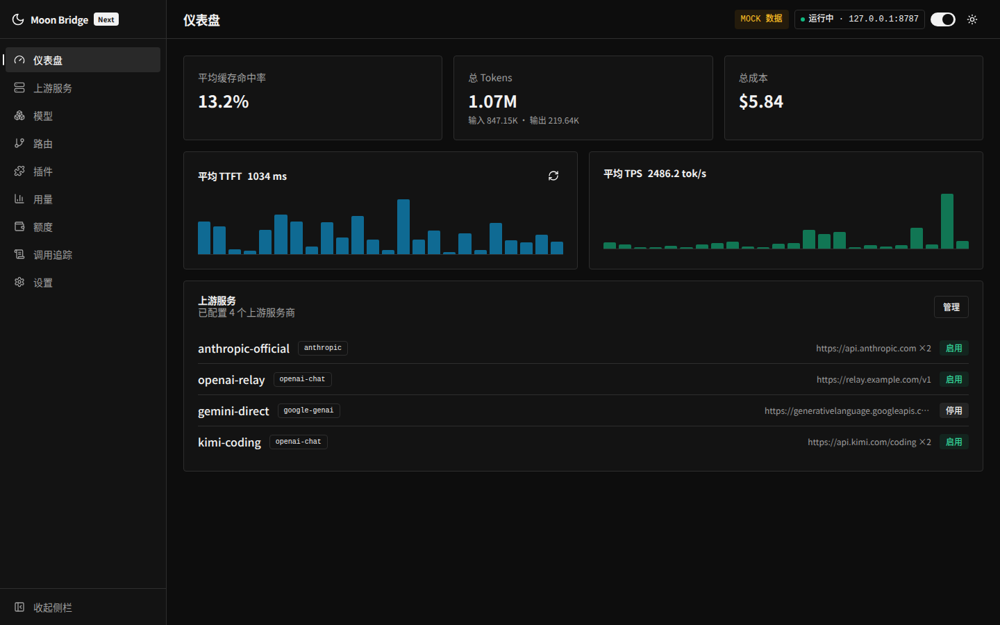
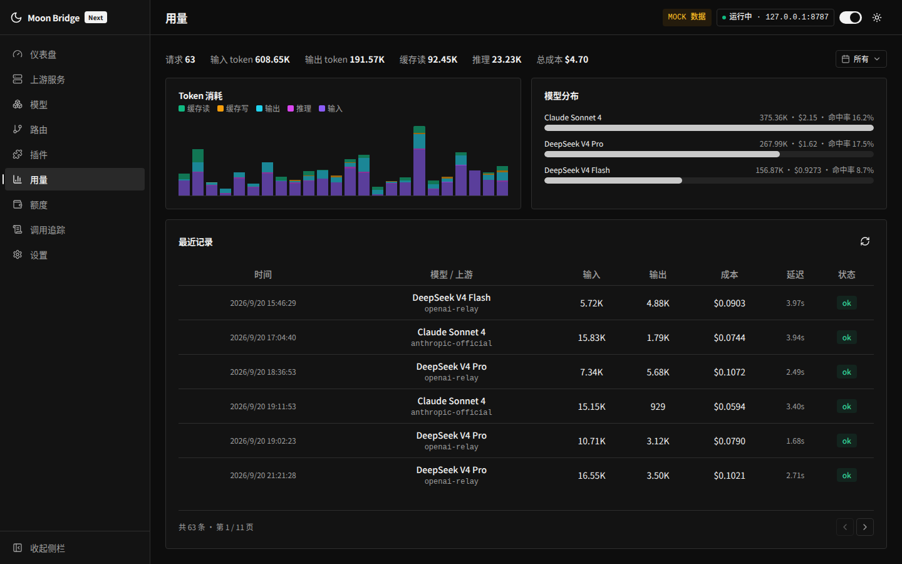
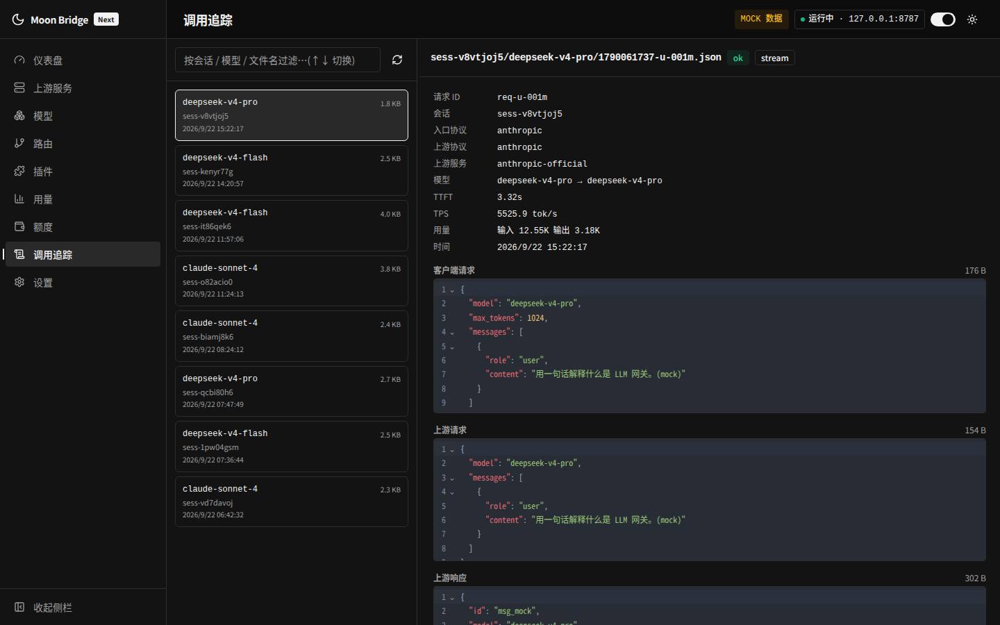
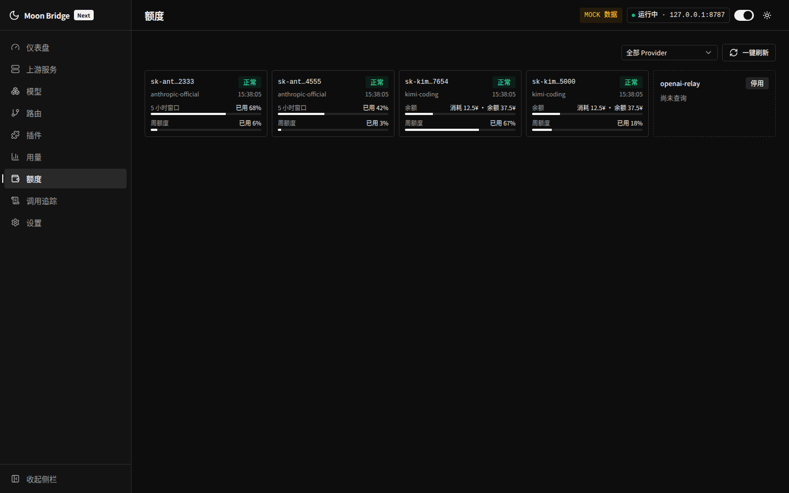
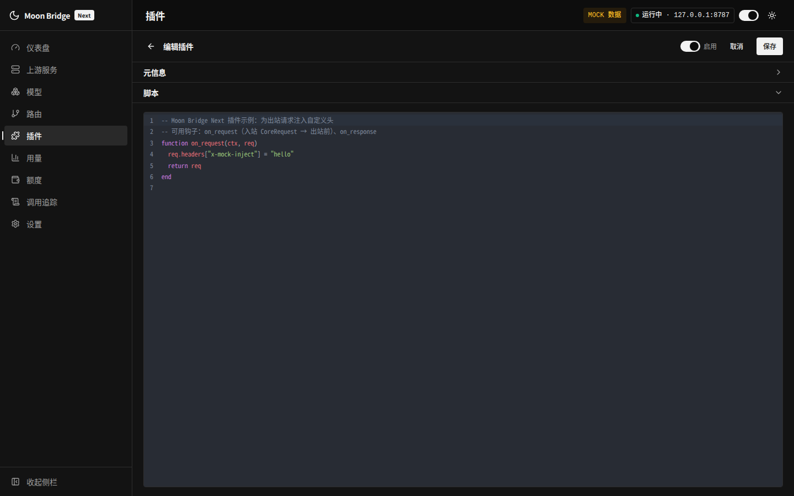
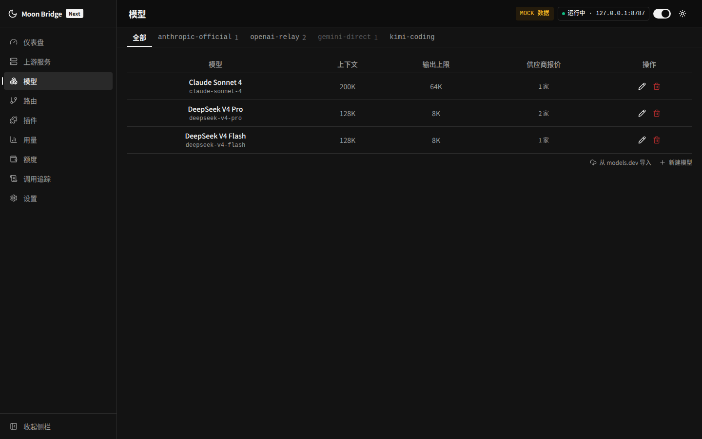

<div align="center">

# Moon Bridge Next

### A local LLM gateway: protocol translation, Lua plugins, usage & quota dashboards

[](LICENSE)
[]()
[](https://tauri.app/)
[](https://www.rust-lang.org/)
[](https://vuejs.org/)

[中文](README.md) · English · [Architecture](docs/architecture.md) · [Development](DEVELOPMENT.md)

</div>

## Why Moon Bridge

Every vendor speaks a different model API: Claude Code talks Anthropic Messages, Codex talks Responses, most tools talk Chat Completions — switching upstream providers often means switching clients, rewriting configs, or not being able to use the provider at all.

Moon Bridge Next is a local gateway between your clients and upstream providers: clients keep speaking the protocol they know, and the gateway translates it into whatever the upstream speaks. On top of translation it ships a Lua plugin system — plugins can modify protocol-neutral request/response semantics, or rewrite the raw HTTP messages flowing in and out. Everything is configured in the bundled management UI; no hand-maintained config files.

- **Any-to-any across four protocols** — OpenAI Responses / Chat Completions / Anthropic Messages / Google Gemini, freely combined in either direction, streaming and non-streaming
- **One plugin for every protocol** — semantic hooks operate on the unified Core IR so they apply to all four protocols at once; wire hooks read and write headers, bodies, and individual SSE chunks
- **Usage & quota built in** — every request records five token counters, latency, and cost; quota plugins show per-key upstream balances, with 12 bundled adapters ready to bind
- **Four-stage request tracing** — raw message snapshots of inbound, outbound, upstream response, and client response, the first place to check plugin rewrites and upstream issues
- **Desktop app + headless server** — a desktop app that works out of the box, plus `moonbridge-server`, a single port hosting the gateway, the management API, and the management UI
- **Credentials encrypted at rest** — provider keys and quota configuration under AES-GCM, with entry tokens, private-network allowlists, and egress proxy support

## Screenshots

|                     Dashboard                     |                    Usage                     |
| :-----------------------------------------------: | :------------------------------------------: |
|       |          |
|                  **Request Traces**               |              **Quota Dashboard**             |
|             |          |
|                  **Plugin Editor**                |               **Model Catalog**              |
|  |    |

## Protocol Support

Translation is built around a central intermediate representation: inbound requests are first normalized into the unified Core IR (`CoreRequest` / `CoreResponse` / `CoreStreamEvent`), then translated into the target protocol by an upstream adapter. This reduces N×M pairwise converters to N+M — a new protocol only needs a two-way adapter to Core IR.

| Protocol | Entry (client → gateway) | Upstream (gateway → provider) |
|------|:---:|:---:|
| OpenAI Responses (`/v1/responses`) | ✓ | ✓ |
| OpenAI Chat Completions (`/v1/chat/completions`) | ✓ | ✓ |
| Anthropic Messages (`/v1/messages`) | ✓ | ✓ |
| Google Generative AI / Gemini | implemented, route not mounted | ✓ |

Bidirectional adapters for all four protocols cover both non-streaming and streaming (SSE). Core IR standardizes content block types (text, image, tool use, tool result, reasoning) and the usage accounting convention (input tokens include cache reads/writes; output tokens include reasoning), so none of this is lost in translation.

Two auxiliary endpoints are also available: `GET /health` and `GET /v1/models`.

## Features

### Provider and Model Management

- **Multi-endpoint providers**: a provider may carry several endpoints, each with its own protocol, base URL, and API key; requests fail over in endpoint order.
- **Model catalog**: search models.dev and batch-import models; context window, maximum output tokens, modalities, reasoning levels, and pricing come along with each entry. Fully manual maintenance is supported too.
- **Offers and pricing**: models are attached to providers through offers. An offer carries a price list (USD per 1M tokens, with separate rates for input, output, cache read, cache write, and reasoning, plus tiered pricing for long contexts) and may be bound to a specific endpoint protocol to control how a model routes on multi-protocol providers.
- **Route aliases**: clients request models by alias; an alias resolves to a provider plus upstream model, so switching upstreams or adjusting failover is transparent to clients.

### Usage Metering

Every request is recorded with its session, client-facing model, upstream model, provider, five token counters (input / output / cache read / cache write / reasoning), time to first token (TTFT), total latency, status (ok / error / aborted), and cost. Cost is computed from the price list in effect at record time; later price changes do not retroactively alter history. The usage page provides summary cards, a stacked token time series, model distribution, and per-request details.

### Request Tracing

With tracing enabled, the raw messages of every request are snapshotted to disk at four stages: inbound, outbound, upstream response, and client response. For streaming requests, the gateway reassembles the event stream into the complete message body before recording, so you can tell exactly "what the upstream actually sent" from "what the client actually received". The Traces page supports browsing, side-by-side inspection, and deletion — the primary means of verifying plugin rewrites and diagnosing upstream issues.

### Quota Dashboard

The Quota page groups by provider and shows the quota and health of every upstream endpoint key in a table: once a provider is bound to a **`quota`-category plugin** (a plugin class that never enters the request pipeline), the engine runs **`MB.query` once per endpoint key** and renders one row per key (masked key labels, independent status and quota figures, per-provider refresh). Bundled quota plugins work out of the box (new-api relays, DeepSeek, Moonshot/Kimi open platform, SiliconFlow, OpenRouter, Zhipu GLM Coding Plan, Kimi Coding Plan, CommandCode, Claude Code subscriptions, and more); you can also write your own on the Plugins page (sandboxed, with `mb.http.request` to reach upstream quota endpoints, returning a `type`-tagged quota contract — percentage / amount / counter, optionally with window duration and reset time). The provider editor offers a query interval (can disable scheduling), instance configuration (encrypted into the database), and a **test query** preview to validate before saving; when a key's query fails, its row is flagged and keeps the last successful result. The number and names of quota bars are entirely script-defined.

### Session Recognition

Session identity is resolved with the following precedence: explicit identifiers carried by the request (the `session_id` or `previous_response_id` body fields, or the `X-Codex-Window-Id` header) come first. For clients that carry no session identifier at all (Qwen Code, for example), the gateway embeds an `[mb:<payload>]` marker at the head of the assistant's **reasoning (chain-of-thought) plaintext**; when the client returns the full conversation history on the next turn, the session is recognized from that marker. For gateway-assigned sessions the payload is the session UUID itself, so the identity does not drift when the active-session table evicts the entry or the gateway restarts (turns without a reasoning block carry no marker). The marker is stripped before anything is forwarded upstream — it never enters the model's context and cannot be imitated by the model. The feature can be disabled in Settings; even then, inbound residual markers continue to be stripped. Session recognition determines the isolation granularity of the plugin API `mb.session` and the session-based organization of trace directories.

### Access Control

The desktop gateway can require an access token (`auth_token`) on its entry points; when configured, client POST requests must carry `Authorization: Bearer <token>`. `GET /health` and `GET /v1/models` remain public as existing behavior. With no token, the desktop gateway performs no entry validation, which is suitable only for loopback listening; Web mode requires separate admin and gateway tokens.

## Quick Start

1. Launch the app; the gateway listens on `127.0.0.1:38440` by default (configurable in Settings).
2. Add a provider on the Providers page: select the protocol, then enter the base URL and API key. Add more endpoints for failover if needed.
3. Import models from the models.dev catalog on the Models page (or create them manually), and create offers for the target provider. Pricing may be left empty, in which case cost is recorded as 0.
4. Create an alias on the Routes page, bound to a provider plus model.
5. Point the client's API address at the gateway, using the alias as the model name:
   - OpenAI-compatible clients: set the base URL to `http://127.0.0.1:38440/v1`;
   - Anthropic-protocol clients: set the base URL to `http://127.0.0.1:38440`;
   - API key field: use the gateway's `auth_token` if configured; otherwise any non-empty placeholder works.
6. Assemble plugins as needed on the Plugins page; save and restart the gateway to apply.

See [DEVELOPMENT.md](DEVELOPMENT.md) for building from source; the frontend can also run standalone with demo data via `VITE_USE_MOCK=1 npm run dev`.

## Plugin System

A plugin is a Lua 5.4 script attached to the request pipeline. The gateway offers two hook layers:

- **The semantic layer (`core`)**: hooks fire after protocol normalization and operate on the unified Core IR — written once, effective across all four protocols;
- **The wire layer (`raw_request` / `raw_response` / `raw_stream`)**: hooks read and write actual HTTP messages — headers, bodies, and every single SSE chunk of a stream — at the outermost edge of protocol conversion.

### What Plugins Can Do

Typical uses of the semantic layer:

- Inject or rewrite system prompts, append messages, adjust request parameters (`temperature`, `max_tokens`, reasoning effort, and so on);
- Append tool definitions via `inject_tools`, giving tool support to clients that don't send any;
- Filter content blocks with `filter_content` (strip reasoning and keep only the final text, for instance), or drop selected streaming events;
- Rewrite error messages uniformly; log requests and count them per session (`mb.session`).

Typical uses of the wire layer:

- Add, remove, or rewrite request/response headers: supply vendor-specific headers the upstream requires, override the User-Agent, or compute HMAC signatures with `mb.crypto`;
- Patch outbound bodies: inject metadata, cap `max_tokens`, and the like;
- Enforce entry authorization: `abort` requests that lack an `Authorization` header;
- Short-circuit with a local answer: return a cached response without contacting the upstream at all;
- Drop noise such as heartbeat SSE chunks;
- Orchestrate across providers with `mb.provider.invoke` — classify the request with a cheap model inside the plugin, then decide where the main request goes.

### The Plugin Manifest

After execution, a script exposes a global `MB` table carrying both the manifest and the hook functions:

| Field | Description |
|------|------|
| `name` | Unique plugin name; the name registered on the Plugins page is authoritative |
| `version` | Version string |
| `scopes` | Scopes the plugin may attach to: `global` / `provider` / `model` / `route` |
| `capabilities` | Hook layers to enable: `core` / `raw_request` / `raw_response` / `raw_stream` |
| `config_schema` | JSON Schema for configuration (optional); the Plugins page renders a form from it |
| `requires` | Enablement prerequisites (optional), e.g. `{ sessionMarker = true }`; the gateway refuses to enable the plugin when unmet |
| `init` / `shutdown` | Lifecycle functions (optional), called in load order before the gateway starts serving and in reverse order after it exits |

Host-provided APIs live under the lowercase global `mb`.

### Semantic-Layer Hooks

| Hook | Description |
|------|------|
| `on_request(ctx, req)` | Modify the request; mutating `req` in place takes effect, or return a new table |
| `inject_tools(ctx)` | Return an array of tools to append |
| `on_response(ctx, resp)` | Modify a non-streaming response |
| `on_stream_event(ctx, ev)` | Inspect a streaming event; return `true` to drop it |
| `filter_content(ctx, block)` | Return `true` to skip a content block; in streaming, subsequent deltas of a dropped block are suppressed as well |
| `transform_error(ctx, msg)` | Return the rewritten error message |

The main fields of `req` (CoreRequest): `model` (the resolved upstream model name), `model_alias`, `system` (an array of ContentBlocks), `messages`, `tools`, `tool_choice`, `max_tokens`, `temperature`, `top_p`, `stop`, `stream`, `reasoning`, `meta` (request-level metadata: `session_id`, raw headers, client identity). Content blocks look like `{ type = "text", text = "..." }`. `resp` (CoreResponse) carries `content`, `stop_reason`, and `usage` (`input_tokens` / `output_tokens` / `cache_read_tokens` / `cache_write_tokens` / `reasoning_tokens`).

### Wire-Layer Hooks

| Hook | Capability | Trigger |
|------|-----------|---------|
| `on_client_request_raw(ctx, msg)` | `raw_request` | Inbound request (client → gateway) |
| `on_upstream_request_raw(ctx, msg)` | `raw_request` | Outbound request (gateway → upstream) |
| `on_upstream_response_raw(ctx, msg)` | `raw_response` | Upstream response (non-streaming) |
| `on_client_response_raw(ctx, msg)` | `raw_response` | Outbound response (gateway → client, non-streaming) |
| `on_upstream_chunk_raw(ctx, chunk)` | `raw_stream` | Upstream SSE chunk (streaming) |
| `on_client_chunk_raw(ctx, chunk)` | `raw_stream` | SSE chunk written back to the client (streaming) |

Fields of `msg`: `stage`, `protocol`, `provider`, `method`, `url`, `status`, `headers` (an order-preserving array `{{k, v}, ...}`), and `body` (JSON table / string / nil; nil with `body_truncated = true` when over the size threshold, in which case the original message is forwarded untouched). Fields of `chunk`: `stage`, `protocol`, `provider`, `event`, `data`, `raw`. In-place modification takes effect; for outbound requests, all four rewrites — `method`, `url`, `headers`, `body` — are honored.

Return-value convention: return `nil` to pass through; message hooks may return `{ action = "short_circuit", status?, headers?, body? }` (answer locally, skipping the upstream) or `{ action = "abort", message? }` (reject the request); chunk hooks may return `{ action = "drop" }`. Short-circuited and aborted requests still produce usage records and traces for auditing.

Capability declarations double as the performance switch: a plugin that does not declare `raw_stream` produces no Lua calls at all during streaming — per-chunk forwarding carries zero overhead.

### Context and Host APIs

Each hook invocation receives a read-only context `ctx`: `request_id`, `session_id` (nil without a session), `model_alias`, `client_protocol` (`openai-response` / `openai-chat` / `anthropic` / `google-genai`), `upstream_protocol`, `provider`, `stream`.

The global `mb` provides the following host capabilities (`http` and `provider.invoke` are async):

| API | Description |
|-----|------|
| `mb.log.debug / info / warn / error(msg)` | Structured logging, tagged with the plugin name |
| `mb.config` | The plugin's own configuration, paired with `config_schema` |
| `mb.session.get(k)` / `mb.session.set(k, v)` | Session-scoped state, isolated by plugin name plus session; cleared automatically when a session is evicted |
| `mb.http.request({ method, url, headers, body, timeout_ms })` | HTTP sub-request returning `{ status, headers, body }`; subject to the host's egress proxy and timeout controls, with a 30-second fallback timeout |
| `mb.provider.invoke(provider, model, req)` | Call another provider directly in Core IR terms and get a CoreResponse back; the entry point for cross-model orchestration |
| `mb.headers.get / set / remove(headers, name)` | Header manipulation, case-insensitive and order-preserving |
| `mb.crypto.sha256 / hmac_sha256 / base64_encode / base64_decode` | Digests and encodings, for upstream signing and similar tasks |

### A Complete Example

This plugin declares both `core` and `raw_request`: the semantic layer injects a system prompt and counts requests per session, while the wire layer adds a header to outbound requests and caps `max_tokens`:

```lua
MB = {
  version = "1.0.0",
  scopes = { "global", "provider" },
  capabilities = { "core", "raw_request" },
  config_schema = {
    type = "object",
    properties = {
      prefix     = { type = "string", title = "Hint injected into system" },
      max_tokens = { type = "number", title = "Cap for max_tokens" },
    },
  },
}

function MB.on_request(ctx, req)
  local n = (mb.session.get("count") or 0) + 1
  mb.session.set("count", n)
  mb.log.info(string.format("[%s] request #%d in session %s",
    ctx.model_alias, n, ctx.session_id or "anon"))
  table.insert(req.system, 1,
    { type = "text", text = mb.config.prefix or "Keep answers short." })
end

function MB.on_upstream_request_raw(ctx, msg)
  msg.headers = mb.headers.set(msg.headers, "x-moonbridge-session", ctx.session_id or "anon")
  if type(msg.body) == "table" then
    local cap = mb.config.max_tokens or 8192
    if msg.body.max_tokens and msg.body.max_tokens > cap then
      msg.body.max_tokens = cap
    end
  end
end
```

### Loading and Management

- Create plugins on the Plugins page: paste an inline script, or point to a `.lua` file inside the plugins directory (paths may not escape that directory);
- Scripts can be edited in-app, and plugins enabled, disabled, or removed; restart the gateway for changes to take effect;
- Bindings attach a plugin to a declared scope — globally, to a provider, to a model, or to a route — and the same plugin may carry a different configuration under each binding;
- A hook that throws is logged as a warning and skipped for that plugin only; neither the request pipeline nor other plugins are affected.

### Sandbox and Quotas

Each plugin owns a dedicated Lua VM running in a sandbox:

- The six dangerous globals `os`, `io`, `loadfile`, `dofile`, `require`, and `package` are removed outright;
- An instruction-count quota (200 million by default) is enforced via a debug hook and covers plugin-created coroutines, so infinite loops are terminated;
- A memory limit (1024 MB by default) and a wall-clock execution timeout guard against slow-running scripts;
- Oversized bodies (threshold 100 MB by default) are not expanded into Lua tables; they are forwarded untouched with a `body_truncated` marker.

### Authoring References

- `plugins/examples/log_request.lua` — semantic-layer example: request logging, session counters, system-prompt injection, error rewriting;
- `plugins/examples/raw_rewrite.lua` — wire-layer example: authorization checks, outbound header rewrites, body patching, heartbeat-chunk dropping;
- `plugins/utils/FxxkDax.lua` — a minimal plugin in production use: injects the session-identifier header its upstream requires;
- `plugins/moonbridge.lua` — an LSP stub: add it to your lua-language-server workspace library for completion and type hints on `MB` and `mb`. In VS Code, for example: `"Lua.workspace.library": { "/path/to/moon-bridge-next/plugins": true }` in settings.json.

## Deployment

### Desktop App

All management happens in the UI: Dashboard (gateway status, usage, provider overview), Providers (endpoints and keys), Models (catalog import and offers), Routes (aliases), Plugins (in-app script editing, enable/disable, effective after gateway restart), Usage (charts and details), Quota (per-key quota dashboard), Traces (message browsing), and Settings (gateway parameters). The system tray provides window recall, one-click gateway start/stop, and quit.

### Server Deployment (Web Mode)

For headless deployments, use `moonbridge-server`: one port serves the LLM gateway, the `/api/*` management REST API, and the frontend static files. Open the address in a browser and enter the admin token to use the same management UI as the desktop app.

- Supply the admin token with `--admin-token` / `MOONBRIDGE_ADMIN_TOKEN`; it is used only by the management API and is never stored or echoed. Supply the gateway token with `--gateway-token` / `MOONBRIDGE_GATEWAY_TOKEN`, or use the existing configured token. It must be non-empty and different from the admin token.
- When upgrading from a shared-token release, put the old value in `MOONBRIDGE_GATEWAY_TOKEN` and generate a different admin token; model clients keep their existing key, while the browser signs in with the new admin token. The web token is held only in page memory, so refresh requires signing in again; the UI is protected by CSP.
- The management API returns `authToken: null`; saving `null` or an empty value preserves the existing gateway token, while an explicit update persists a new gateway token. Saving unrelated settings does not persist an environment override.
- The multi-stage `Dockerfile` builds the frontend, compiles the server, and runs a slim image as uid 10001; `deploy/soul/` contains a Docker Compose example. "Restart gateway" gracefully drains requests in-process, runs lifecycle hooks, and rebinds without a supervisor; status reports the actual bound address. Each gateway generation has one quota scheduler, and restart cancels the previous generation's tasks.
- For public exposure, place a reverse proxy in front for TLS termination, and protect the two tokens separately.

### Credential Storage and Upgrade Backups

The default file database encrypts provider credentials and quota-query configuration uniformly with AES-GCM; V13 migrates legacy data and encryption metadata transactionally. The default key file is `<db>.key`; use `--key-file` / `MOONBRIDGE_KEY_FILE` to choose another path. Unix key files use mode `0600`; Windows wraps the key with current-user DPAPI, so recovery is bound to that account. Missing or incorrect keys fail closed rather than falling back to plaintext.

Back up the database and key file together. Before upgrading, keep a separate database backup: an old image cannot directly roll back against a database written by the new encrypted library; restore the pre-upgrade database and matching credential material to roll back. The frontend may still handle credentials while editing or querying; encryption protects the listed fields at rest, not the entire database, configuration, or traces.

### Quota Query Security Boundaries

Quota-script HTTP requests may reach only the same origin or an explicitly authorized origin; private and cloud-metadata addresses are denied by default. To allow a private origin, set `MOONBRIDGE_QUOTA_PRIVATE_ORIGINS` at startup to a JSON array of exact origins, for example `["https://quota.internal.example:8443"]`; quota configuration cannot grant access, and metadata endpoints remain forbidden. Requests do not use the system proxy, do not follow redirects, and pin the validated DNS address; decompressed responses are limited to 1 MiB, with a 30-second per-request timeout and a 45-second per-provider timeout.

When `egressProxy` is explicitly configured, quota HTTP reports proxy use as unsupported instead of silently going direct; gateway inference requests still support the proxy. Script results of `nil` or an invalid `status` are errors. The new-api plugin computes balance from current `data.quota / quota_per_unit` (default 500000), not `used_quota`; the Kimi plugin tolerates a single available quota window.

## FAQ

<details>
<summary><strong>When do plugin changes take effect?</strong></summary>

Plugins are loaded into the Lua runtime when the gateway starts. After creating, editing, enabling, disabling, or deleting a plugin on the Plugins page, click "Restart gateway" to apply — in-flight requests are drained in-process, `shutdown`/`init` lifecycle hooks run, and the listener is rebound. The app itself does not need a restart.

</details>

<details>
<summary><strong>Why are there no traces?</strong></summary>

Traces require a `trace_dir`, which desktop and Web modes enable by default under the data directory. To keep only metadata without message bodies, turn off "record request/response bodies" in Settings. Traces are also pruned by modification time, keeping the most recent N entries (500 by default) — older files are removed automatically.

</details>

<details>
<summary><strong>Can quota queries reach private-network addresses?</strong></summary>

Not by default — quota-script HTTP requests deny private and cloud-metadata addresses. To allow specific origins, whitelist exact origins via the `MOONBRIDGE_QUOTA_PRIVATE_ORIGINS` environment variable (see "Quota Query Security Boundaries" above).

</details>

<details>
<summary><strong>Where is my data stored?</strong></summary>

Desktop and Web modes share the application data directory (`com.moonbridge.next`) by default: the `moonbridge.db` database, the `moonbridge.db.key` key file, the plugins directory, and the traces directory. The server can point elsewhere with `--config-dir` / `--data-dir` / `--key-file`.

</details>

## Documentation

- [docs/architecture.md](docs/architecture.md): the architectural contract — Core IR definitions, hook semantics, storage schema, request lifecycle, and every other design detail; the entry point for downstream development.
- [DEVELOPMENT.md](DEVELOPMENT.md): build, run, test, and engineering conventions.

## License

This project is released under GPL-3.0-or-later; see [LICENSE](LICENSE) for the full text.
